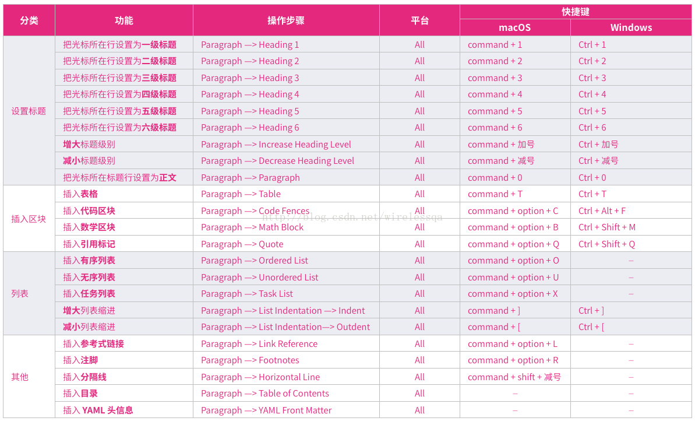

# Typora的使用

## 1.快捷键

### 1.1表格

Ctrl+t

例如：

|      |      |      |
| ---- | ---- | ---- |
|      |      |      |
|      |      |      |
|      |      |      |


### 1.2图片

先点开文件--设置偏好

.png)

Ctrl+Shift+i

其他快捷键



.png)

### 1.3设置目录

在视图打开大纲

在选择的目录旁使用Ctrl+1，Ctrl+2，Ctrl+3，Ctrl+4，Ctrl+5，Ctrl+6依次建立一级到六级目录

.png)

### 1.4贴代码

使用```+代码语种（使用英文模式添加j键盘1旁）

.png)

例如

```json
{
    "name":"张三",
    "age":18
}
```

### 1.5贴跳转链接

复制了链接后Ctrl+k，在小方框中输入链接代表的名字

[Typora ---一款简洁的Markdown编辑器](https://www.cnblogs.com/-guz/p/10258557.html)

如要跳转按住Ctrl+鼠标右击

## 2小技巧

初始化时有可能输入时修改之前输入不习惯

以下情况

.png)

可以按Insert变成正常的修改输入

## 3导出

点击文件--导出，可以导出为各种格式例如：html，docx，pdf等

## 4下载地址

[windows](https://www.typora.io/#windows)

linux输入命令

.png)


